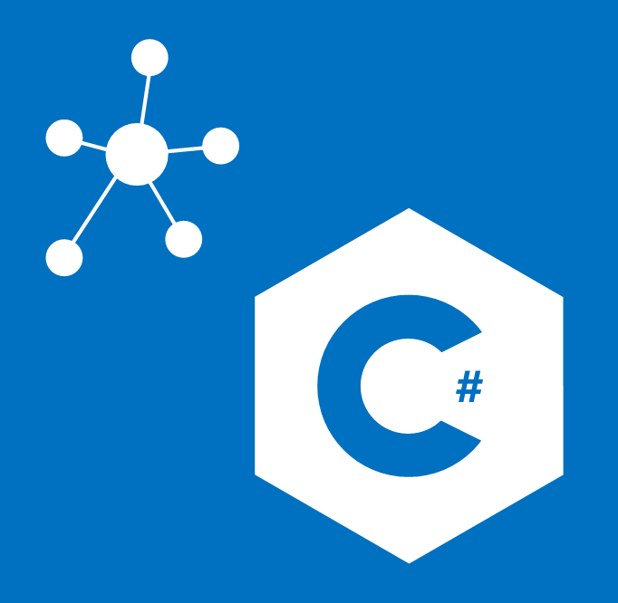

## What's in the `System.Domain`?

[](https://ci.appveyor.com/project/stijnmoreels/system-domain)
[](https://www.nuget.org/packages/system-domain/)

This package contains some basic Domain models togheter with a `Result{TOk, TError}` type.
Its purpose is to force the developer to use Domain Specific models instead of untrusted standard models like `int`, `string`, ...



### Trusted Models

This package contains some models that's frequently been used but only a very few times modelled correctly:

* `PositiveInt` represents a positive `int`. Instead of using `int` everywhere and _assume_ its value is positive, use this model.
* `NonEmptyString` represents a non-empty `string`. Instead of using `string` everywhere and _assume_ its value is neither `null` or `""`, use this model.
* `NonEmptySeq<T>` represents a non-empty `IEnumerable<T>`. Instead of using `IEnumerable<T>` everywhere and _assume_ its value contains at least a single element, use this model.

Every of these models can be initialized via two _Factory Method_'s. Following example shows how this is done for a `PositiveInt` using the `.Maybe()` call.:

> For more information about the `Maybe<T>` type, see the package: [System.Functional](https://github.com/stijnmoreels/System.Functional/)

```csharp
var x = PositiveInt.Maybe(1);
Console.WriteLine(x);

// Just<int>: 1

var y = PositiveInt.Maybe(-10);
Console.WriteLine(y);

// Nothing<int>
```

Or we could use the `Result{TOk, TError}` type for this.
Following example shows how this could be done for a `NonEmptyStirng` using the `.Result()` call.

```csharp
var x = NonEmptyString.Result("I'm not empty!");
Console.WriteLine(x);

// Ok<NonEmptyString>: NonEmptyString: I'm not empty

var y = NonEmptyString.Result(string.Empty);
Console.WriteLine(y);

// Error<NonEmptyString>: The '' String is null or empty! Please provide a non-empty string.
```

### Untrusted Models

When communicating with the outside world, we often find ourselves using default models like `int`, `string`, `byte`, ... These models represents the most general form of the type you're needing, but it's very rare that these models represents models in your specific domain.

Positive integers could best be represented by a model that validates on this rule and not by a model that allowes non-valid inputs.
If we would use these default, non-validated models in our application; you end up with checking them for the right values in each method call and you're nevery 100% sure that the incoming `int` for example is a positive int.

This package contains also a way to indicate that the incoming model is not validated yet. This could be done by using the `Untrusted<T>` model. This model just wraps the incoming value, and the only way to unwrap it is to send a validator with it.

Following example tries to validate the age of a person:

```csharp
// Get's the age (positive int representation) of somewhere...
int x = GetAge();
Untrusted<int> y = Untrusted.Wrap(x);

Maybe<PositiveInt> result = y.Unwrap(PositiveInt.Maybe);
```

## Contributing

Pull requests very welcome!

Check out the issues marked up-for-grabs if you need any inspiration.

It's very rare that we reject PRs. Generally, if you intend to make a bigger change, it's better to open an issue first to discuss.
